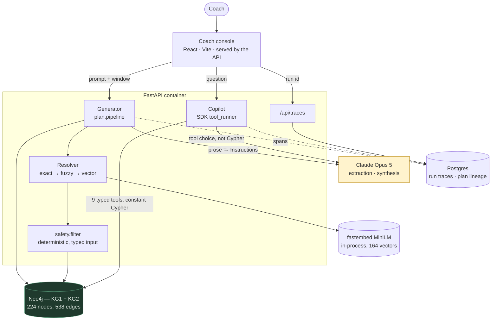

# FutureCo — knowledge-graph-backed coach dashboard

A coach-facing dashboard over two knowledge graphs: **KG1**, the movement and clinical domain, and **KG2**, one member's context. Safety is enforced by deterministic graph traversal, never by prompt instruction — the filter takes a typed constraint set, not a string, so no language model has a path around it.

**Live: [api-production-db867.up.railway.app](https://api-production-db867.up.railway.app)** — the coach console, served by the API from one origin. Both graphs are seeded at deploy time by the same `graph.build.main` that `docker compose up` runs, so it holds the same 224 nodes and 538 edges as a local build; [`/health`](https://api-production-db867.up.railway.app/health) reports the live counts. Extraction is live there, so the model half works too.

Full spec in [`ASSESSMENT.md`](./ASSESSMENT.md). Synthetic data only.

## Architecture



**The missing arrow is the design.** Nothing runs from the model to Neo4j. `safety.filter.run` takes a `Composition` — a typed constraint set — so there is no path from prose to a traversal, and a test walks the ASTs under `plan/` to keep it that way. The model turns a sentence into `Instruction` objects at the very front and is never consulted again; the copilot chooses *which* of nine tools to call, never what Cypher they run.

## Architecture & tech choices

Selection criteria, in priority order: (1) the safety decision must be a deterministic traversal, so nothing may sit between a request and a Cypher result; (2) `docker compose up` must work from a cold clone weeks later — no signups, no free tiers that lapse; (3) one-day build; (4) typed contracts end to end.

| Layer | Choice | Why this one |
|---|---|---|
| Graph | **Neo4j 5** + Cypher | The variable-length `part_of` closure is the deliverable. As SQL it becomes a recursive CTE that buries the reasoning a reviewer is grading |
| Backend | **FastAPI** + Pydantic v2 | One definition of a `Verdict` serves the domain, the HTTP response *and* the model's output schema. "Typed contracts" is what is being assessed |
| LLM | **`claude-opus-5`**, official SDK | `messages.parse()` gives schema-guaranteed structured output, so extraction needs no parsing layer and no framework |
| Generator runtime | One call, **no framework** | LangGraph would state-machine a straight line; Pydantic AI would re-guarantee what Pydantic already guarantees. There is no loop to orchestrate |
| Copilot runtime | SDK **`tool_runner`** | Open-ended retrieval genuinely needs a loop — and per-turn hooks are the natural place to record the trace |
| Traces | **Postgres**, one row per run | Self-hosted and queryable with SQL. Langfuse is three more containers; LangSmith is a signup and a second key |

Full table including **every rejected alternative and why** — ArangoDB, Litestar, LangChain's `GraphCypherQAChain`, `sentence-transformers`, Jaeger, Next.js — is in [`docs/tech-stack.md`](./docs/tech-stack.md).

Ontology grounding — what was taken from SNOMED CT, SKOS and PROV-O, and why **OPE and COPPER were evaluated and declined** — is in [`docs/ontologies.md`](./docs/ontologies.md).

**Challenges and trade-offs** are in [`docs/decisions.md`](./docs/decisions.md), one numbered entry per decision with what was rejected and why. The ones worth reading first: splitting `contraindicated-for` into `contraindicates` and `cautions` so a coach can override one and not the other; refusing to derive contraindications from `affects` → `part_of` → `stresses`, which would rule out every knee-loading exercise the rehab protocol actually wants; keeping the goal anchor an authored exception rather than a weight, so it cannot quietly outrank safety; and the adjustment bug, where refinement rebuilt from the last utterance and silently dropped constraints nobody had withdrawn.

## Run it

```bash
docker compose up
```

Then open **http://localhost:8000**.

That starts Neo4j and Postgres, seeds both graphs (**224 nodes, 538 edges**), and serves the API *and the coach console* from one origin. The console is built inside the image — no second terminal, no `npm install`, no Node on your machine. Nothing needs the network at runtime; the embedding weights are baked in at build time.

| Service | URL | Notes |
|---|---|---|
| Coach console | http://localhost:8000 | Served by the API, so same-origin by construction |
| API docs | http://localhost:8000/docs | `/health`, `/api/resolve`, members, plans, copilot, traces |
| Neo4j Browser | http://localhost:7474 | `neo4j` / `futureco-local` |
| Postgres | `localhost:5432` | `futureco` / `futureco-local` — run traces and plan lineage |

**Prerequisites: Docker.** That is the whole list. An `ANTHROPIC_API_KEY` is optional — without one the generator produces **identical plans** (extraction is its entire model surface, so it just has to be handed instructions rather than a sentence) and the copilot runs the same retrieval and says outright that nothing interpreted it.

Set `API_PORT`, `NEO4J_HTTP_PORT`, `NEO4J_BOLT_PORT` or `POSTGRES_PORT` in `.env` if a port is taken. The seed is idempotent, so a second `up` converges rather than duplicating. To work on the console with HMR: `cd web && npm run dev` on :5173, proxying `/api` here.

Three calls worth making by hand, because each demonstrates something the UI hides:

```bash
curl "localhost:8000/api/resolve?term=pecs"       # alias -> chest
curl "localhost:8000/api/resolve?term=deadlifts"  # declines, and says how far off it was

# Mock auth, real authorization: a member is readable only when a
# `coaches` edge joins her to that coach. 404 rather than 403 — a 403
# confirms the member exists, which makes the id space worth enumerating.
curl -H "X-Coach-Id: coach_nobody" localhost:8000/api/members/mbr_01HX9JORDAN
```

The full HTTP surface is browsable at [`/docs`](http://localhost:8000/docs).

## How a plan is built

```
prose ─[LLM]─▶ Instruction[] ─▶ resolve ─▶ compose ─▶ Composition
                                                          │
                                                   filter.run ── all 50 judged
                                                          │
                                         substitute ─▶ pack ─▶ WorkoutPlan
                                                          │
                                                    ProvenanceTrace
```

**One model call, at the very front.** Everything after the first arrow is Python and Cypher. The model turns a sentence into `Instruction` objects and never touches the graph — `safety.filter.run` takes a `Composition`, so there is no typed path from prose to a traversal, and a test walks the ASTs under `plan/` to keep it that way.

That means the whole generator runs **without an API key**: hand it the instructions instead of a sentence and you get the same plan. It is the path the CLI probe below takes, and the worked examples are reproducible because of it.

## Worked examples

Three, in [`docs/worked-examples.md`](./docs/worked-examples.md) — real output, not illustrations. The first two come from `plan.probe`, the generator with no model in it, so they reproduce byte-for-byte with or without a key.

**The injury case.** A coach flags the knee; all 17 eligible movements survive, because flagging a structure down-ranks rather than excludes — the graph knows an exercise *loads* the knee, not that doing so is harmful.

```
  2 x 15   Alternating Dumbbell Racked Crossback Lunge   <- anchored on a goal
      caution   Loaded knee flexion with a long lever at the front knee.
                Tolerable at partial range, so a penalty rather than a hard exclusion.
```

That caution is a clinician's sentence from `contraindications.json`, quoted rather than generated.

**The limited-equipment case.** Dumbbells only: 45 of 50 movements go, and the plan *says so* rather than presenting five as a full session — 24m32s of a 45-minute window, an empty cooldown, four uncovered slots each naming the equipment limit as its cause. Substitutions can only ever offer a movement the filter already cleared, and must share the dropped one's *primary* pattern, so no stand-in can route around a contraindication.

**The refinement case** runs the three scenarios at `ASSESSMENT.md:27-31` as one conversation against the live model, and shows the two things a single-shot example cannot: that constraints **accumulate** across refinements, and that a decline is **reported rather than absorbed** — `deadlifts` reaches 0.40 against a 0.90 threshold and the resolver refuses rather than guessing at `Barbell`.

## Tests

```bash
docker compose up -d neo4j
cd backend && uv sync && uv run pytest      # 321 backend tests, 11 frontend
```

Traversal tests need Neo4j; packing, prescription and policy are pure. **No test needs Postgres or a key** — the stores fall back to bounded in-memory implementations when `DATABASE_URL` is unset, and the keyless copilot tests force that path with a fixture rather than asserting whatever `.env` happens to hold.

One test calls the real API and is deselected by default, since it costs money and needs a key. It asserts the live model produces the same `Instruction`s as the offline stand-in over the same labelled cases — which is what stops the stand-in becoming fiction.

```bash
uv run pytest -m live
```

## Repo map

**Docs**

| Doc | What it holds |
|---|---|
| [`decisions.md`](./docs/decisions.md) | Every schema and design decision, and what was rejected. The challenges-and-trade-offs record |
| [`ai-engineering.md`](./docs/ai-engineering.md) | How the model is constrained, evaluated, and caught when wrong |
| [`evaluation.md`](./docs/evaluation.md) | Production metrics, failure modes, and what is *not* detected today |
| [`ontologies.md`](./docs/ontologies.md) | What was pulled from each ontology, what was left out, and why |
| [`tech-stack.md`](./docs/tech-stack.md) | Every choice with its rejected alternatives |
| [`kg1-schema.md`](./docs/kg1-schema.md) · [`kg2-schema.md`](./docs/kg2-schema.md) | Node and edge types per graph |
| [`worked-examples.md`](./docs/worked-examples.md) | Real generator output with its provenance trace |
| [`frontend-spec.md`](./docs/frontend-spec.md) | Every console component traced to the line of the spec that requires it |

**Source**

| Path | Purpose |
|---|---|
| `backend/src/resolve/` | Three-pass concept resolver, and the mention scanner over free text |
| `backend/src/safety/` | The deterministic filter, its policy weights, and provenance |
| `backend/src/plan/` | Section table, prescription, time solver, substitution, reasons |
| `backend/src/copilot/` | The copilot's typed retrieval tools, charts, citation check and agent loop |
| `backend/src/graph/recording.py` | Session wrapper and stage timer behind every generator trace |
| `backend/src/api/` · `web/` | FastAPI service and wire contract; the React console built against `web/src/types/index.ts` |
| `data/authored/` | Hand-authored anatomy, muscle-to-SNOMED mappings, SKOS collections, contraindications, aliases, metric bands, session-pattern mappings, coaches, and the resolver and extraction cases |

## Observability

Both surfaces record every run to Postgres and the Traces tab reads them — **nothing on that screen is fabricated**. A generator trace nests each graph read under the stage that issued it, because `RunRecorder` hands the stage timer and the session wrapper one clock: offsets are measured, not reconstructed by summing durations.

The first trace off the rebuilt path made its own point — **3437 ms of a 3483 ms run inside the single extraction call**, against under 45 ms for all 74 graph queries. Every latency instinct I had was about the Cypher, and all of it would have been wasted.

## How I used AI to build this

**Built end to end in about a day**, on a division of labour I hold to deliberately: **I own the model of the problem; AI owns execution against tasks I have already made verifiable.**

- **Requirements first, and traceable.** The code carries **22 citations of specific `ASSESSMENT.md` line numbers across 17 files** (12 more in the design docs, 19 distinct spec lines in all), so every non-obvious decision names the requirement it answers — and I could always tell whether a thing I was about to build was mandated, implied, or my own invention. `frontend-spec.md` adds a *"Cut, with reasoning"* table for everything deliberately not built, which is most of scoping a one-day build and the part a model will not do for you.
- **The judgment calls stayed mine.** Splitting `contraindicated-for` into `contraindicates` and `cautions`, because a coach may override a caution and never a contraindication. Refusing to derive contraindications by walking anatomy — elegant, and it would have excluded every knee-loading exercise the member's own rehab protocol wants. The grain rule that decides what earns a node in KG2. Each is in `decisions.md` with what was rejected.
- **Harness over repetition.** Specs with acceptance criteria and explicit non-goals before delegating, so "done" was decidable before work started; standing rules in `CLAUDE.md` rather than corrections given twice; a `/review` command that instructs adversarial critique, because the default failure mode of an assistant is to agree; sub-agents for codebase-wide search so the main context keeps the decision rather than the file dumps.
- **Evals before prompts.** Labels written before the model ran; first pass it agreed with **three of eight** — four prompt bugs, **two labels of mine that were wrong**, one self-inconsistency. Thresholds swept rather than chosen, and the sweep *falsified my design*: `overhead press` ranks at 0.528 and `deadlift`, which must resolve to nothing, reaches `Barbell` at 0.523. A five-thousandth gap no threshold separates.

Full treatment — the harness in detail, all six modelling judgment calls, verifiable-versus-unverifiable model output, the Opus 5 thinking failure mode, and the two things the model got confidently wrong — in [`docs/ai-engineering.md`](./docs/ai-engineering.md).

## Evaluating this in production

Full treatment in [`docs/evaluation.md`](./docs/evaluation.md) — metrics, failure modes with whether anything currently detects them, and what to page on versus review weekly. The short version:

- **The invariant, not a metric:** no plan may contain a movement the member's condition contraindicates. Checkable on every run without sampling, because the filter scores all 50 and keeps the verdicts. Non-zero is a page.
- **The dangerous failure is silent misresolution**, not a decline. A phrase that resolves to nothing is visible on the sheet; one that resolves confidently to the wrong concept is not. Sampled audit of the near-threshold band.
- **The honest limit:** citations are verified against what retrieval returned and charts are built server-side from the graph, but **figures inside prose are unchecked**. A model can misquote a number it was correctly given and nothing here catches it. Fixing it means making numbers structured fields the server renders — the move already made for charts.
- **The cheapest real signal is already being collected.** An adjustment is a new run with a parent pointer, so a refinement chain *is* a quality label: a plan adjusted three times was wrong three times, and the utterances say how.

Known gaps are named at the end of that document rather than implied — no retrieval-relevance eval, no plan-quality eval, and one synthetic member, which is worth more than any additional metric.

## Status

Built and tested end to end: both knowledge graphs, the concept resolver, the safety filter, the workout generator, the extraction agent, the coach copilot, run tracing, the API container serving the console, and 321 backend tests.

The catalogue's taxonomies carry a SKOS layer: every concept has a preferred label, its synonyms and a scheme, and 47 of them map into SNOMED CT with the relation that says how much the mapping lost. [`docs/ontologies.md`](./docs/ontologies.md) records what was taken from each ontology and what was not.

KG2 holds the member's whole record — sessions, chat, biomarkers, labs and adherence — at three grains: traversed entities, leaf observations, and node properties. `docs/kg2-schema.md` records which block lands where and why.

Known gaps, in the order they matter:

- **Copilot latency.** Measured 13 s against the spec's ~5 s target — three model turns in the tool loop. The generator lands at 3.5 s, of which 3.4 s is its single extraction call. Both figures come from real traces, and the copilot one is the first thing I would attack.
- **Streaming.** Answers render whole. The generator names its pipeline stages while working and the copilot shows a skeleton, so the wait is legible, but token-by-token streaming is the remaining upgrade.
- **Retrieval and plan-quality evals.** The resolver and extractor have labelled eval sets; the copilot and the planner do not. Ranked with the rest in [`docs/evaluation.md`](./docs/evaluation.md).
