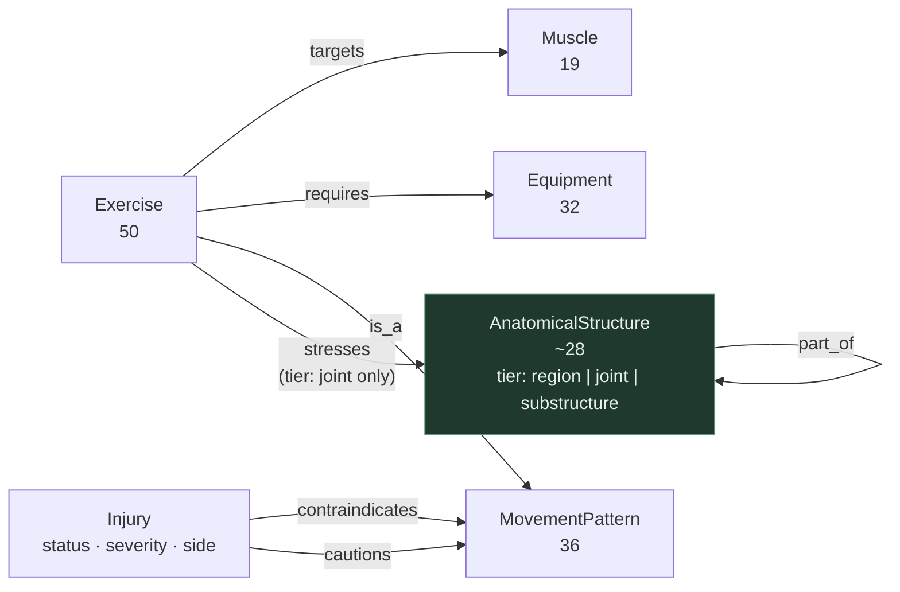

# KG1 — Movement / Clinical Domain Schema

## Node types

| Node | Count | Source | Notes |
|---|---|---|---|
| `Exercise` | 50 | `data/exercises.json` | Performable catalog item; carries sets/reps into a plan |
| `Muscle` | 19 | data — `muscle_groups` | Tissue doing the work |
| `AnatomicalStructure` | ~28 | 9 joints from `joints_loaded`; regions and sub-structures authored, SNOMED-grounded | One self-nesting hierarchy via `part_of`. `tier` property = `region` \| `joint` \| `substructure`. **Invariant: `stresses` only ever targets `tier: joint`** |
| `MovementPattern` | 36 | data — `movement_patterns` | Kinematic class; the substitution axis |
| `Equipment` | 32 | data — `equipment_required` | |
| `Injury` | 1 (sample) | `data/member-context.json` — `injuries[]` | Holds `status`, `severity`, `side` (from `region: "left knee"`), and `snomedct_hint`. Origin of both contraindication edges |

---

## Edge types

| Edge | From → To | Source | Purpose |
|---|---|---|---|
| `targets` | Exercise → Muscle | spec + data | Programming coverage |
| `stresses` | Exercise → AnatomicalStructure `[tier: joint]` | spec + data | Load-bearing anatomy; safety |
| `requires` | Exercise → Equipment | spec + data | Availability filter |
| `is_a` | Exercise → MovementPattern | **added** | Spec lists the node type but no edge to it — without this, pattern nodes are orphans and substitution is impossible |
| `part_of` | AnatomicalStructure → AnatomicalStructure | spec; hierarchy authored from SNOMED | Self-nesting. Granularity bridging, traversed in both directions |
| `contraindicates` | Injury → Pattern \| Exercise | spec (`contraindicated-for`), split | **Hard exclude** |
| `cautions` | Injury → Pattern \| Exercise | **added** (other half of the split) | **Soft penalty** — relative contraindication |

---

## Diagram



`part_of` self-nests, so one hierarchy spans every granularity a coach might name:

```
region        Lower limb
                ^ part_of
joint         Knee                  <- stresses lands here, always
                ^ part_of
substructure  Patellofemoral joint · ACL · MCL · Patellar tendon
```

Queries enter at whatever tier the resolver hits ("lower body", "knee", "patellar tendon") and traverse `part_of` transitively in either direction to reach the joint tier.

---

## Substitution

Equipment swaps traverse the pattern axis, not muscle overlap:

```
Barbell Decline Bench Press -requires-> Barbell (unavailable) → drop
  -is_a-> "upper push - horizontal"
  <-is_a- {Dumbbell Neutral-Grip Bench Press, Push-Up to Knee-Drive, ...}
  → filter by available equipment → rank → substitute
```

Muscle overlap alone is weaker: Dumbbell Incline Chest Fly also targets chest but is a different pattern and a poor swap for a press.

---

## Decisions & deviations

**Deviations from the starting schema in `ASSESSMENT.md:54-56`:**

1. **Added `is_a`.** The spec lists movement patterns as a node type but no edge reaching them. Taken literally, those nodes are unreachable.
2. **Split `contraindicated-for` into `contraindicates` + `cautions`.** Absolute vs. relative contraindication is a real two-valued clinical distinction. Two relations put the meaning on the edge rather than in a property a traversal must inspect, and let the hard filter and the ranker run as separate passes with separate provenance sentences — a coach can override a caution, not a contraindication.
3. **Collapsed body region, joint, and sub-structure into one `AnatomicalStructure` type.** They form a single hierarchy joined by a single edge that runs nowhere else; three labels for three positions in one taxonomy is a distinction without a difference. SNOMED CT models it the same way — one "Body structure" hierarchy, where knee, patellofemoral joint, and lower limb are all body structures distinguished by subsumption, not by type. Collapsing also makes the traversal direction-agnostic: one transitive `part_of` closure serves both the "lower body" query descending and the "patellar tendon" query ascending.
4. **`Injury` lives in KG1, and contraindication edges originate from it directly.** This matches the spec's own gloss — *`contraindicated-for` (injury → unsafe movements)*.
