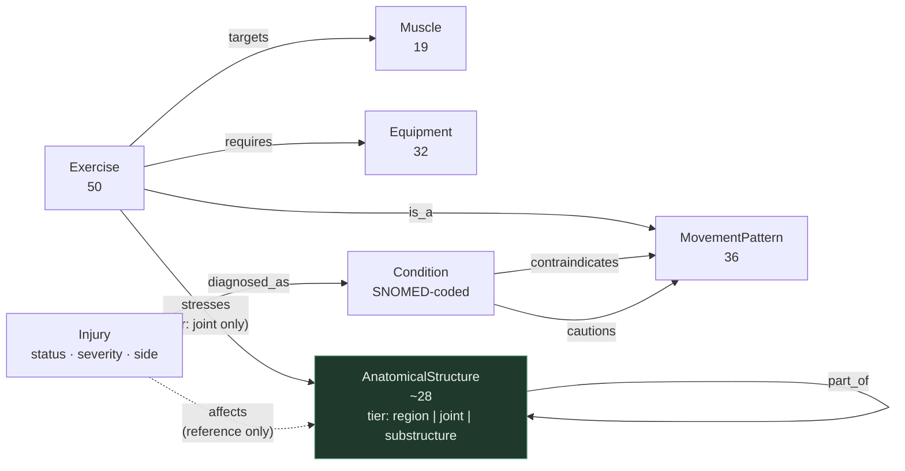

# KG1 — Movement / Clinical Domain Schema

## Node types

| Node | Count | Source | Notes |
|---|---|---|---|
| `Exercise` | 50 | `data/exercises.json` | Performable catalog item; carries sets/reps into a plan |
| `Muscle` | 19 | data — `muscle_groups` | Tissue doing the work |
| `AnatomicalStructure` | 27 | `data/authored/anatomy.json` — 6 regions, 9 joints, 12 sub-structures. The 9 joints are the ones `joints_loaded` names; every row carries a SNOMED CT code resolved by `scripts/verify_snomed.py` | One self-nesting hierarchy via `part_of`. `tier` property = `region` \| `joint` \| `substructure`. **Invariant: `stresses` only ever targets `tier: joint`**, pinned in the MATCH |
| `MovementPattern` | 36 | data — `movement_patterns` | Kinematic class; the substitution axis |
| `Equipment` | 32 | data — `equipment_required` | |
| `Injury` | 1 (sample) | `data/member-context.json` — `injuries[]` | **This member's case**, and only that: `region`, `joint`, `side` (derived: `region` minus `joint`), `status`, `severity`, `since`, `notes` |
| `Condition` | 1 (sample) | `data/authored/contraindications.json` | **The clinical entity**, and what it implies for movement. Holds the SNOMED code, because the condition is what SNOMED names — an injury is an instance of one. Origin of both contraindication edges |

---

## Edge types

| Edge | From → To | Source | Purpose |
|---|---|---|---|
| `targets` | Exercise → Muscle | spec + data | Programming coverage |
| `stresses` | Exercise → AnatomicalStructure `[tier: joint]` | spec + data | Load-bearing anatomy; safety |
| `requires` | Exercise → Equipment | spec + data | Availability filter |
| `is_a` | Exercise → MovementPattern | **added** | Spec lists the node type but no edge to it — without this, pattern nodes are orphans and substitution is impossible |
| `part_of` | AnatomicalStructure → AnatomicalStructure | spec; hierarchy authored from SNOMED | Self-nesting. Granularity bridging, traversed in both directions |
| `diagnosed_as` | Injury → Condition | **added** — `injuries[].condition` in member context | Joins a member's case to the clinical knowledge about it. Named rather than reusing `is_a`, which already means classification for `Exercise → MovementPattern` |
| `contraindicates` | Condition → Pattern \| Exercise | spec (`contraindicated-for`), split. Rules in `data/authored/contraindications.json` | **Hard exclude**. Carries `rationale` for the provenance trace |
| `cautions` | Condition → Pattern \| Exercise | **added** (other half of the split), same source | **Soft penalty** — relative contraindication. Carries `rationale` |
| `affects` | Injury → AnatomicalStructure `[tier: joint]` | **added** — `injuries[].joint` in member context | Anatomical reference only. **Never traversed to filter** — it records where an injury sits so a resolved anatomy term can be tied back to it |

---

## Diagram



---

## The SKOS layer

Every concept in this graph carries `pref_label`, `alt_labels` and `in_scheme`, and 47 of them carry a typed mapping into SNOMED CT. It is **properties only** — no new node types, no new edges, and nothing downstream reads it to make a decision.

| Taxonomy | Concepts | Grounding |
|---|---|---|
| `AnatomicalStructure` | 27 | SNOMED CT — 27 `exactMatch` |
| `Muscle` | 19 | SNOMED CT — 10 `exactMatch`, 4 `closeMatch`, 4 `narrowMatch`, 1 `broadMatch` |
| `Condition` | 1 | SNOMED CT — 1 `exactMatch` |
| `MovementPattern` | 36 | `skos:Collection` — 10 local groups, no external mapping |
| `Equipment` | 32 | `skos:Collection` — 7 local groups, no external mapping |

Three things were already SKOS under other names and are now called what they are: `aliases.json` is the `skos:altLabel` set, `part_of` is `skos:broader` (partitive), and the anatomy rows' SNOMED columns are a mapping. Why equipment and patterns are deliberately ungrounded, and why OPE and COPPER were evaluated and declined, is in [`ontologies.md`](ontologies.md).

---

## Two ways anatomy reaches a filter

Safety filtering runs **top-down from the injury**: `Injury -diagnosed_as-> Condition -contraindicates-> MovementPattern <-is_a- Exercise`. Authored, clinical, and fixed-length. A recorded knee injury excludes deep-flexion-under-load and plyometric patterns because a clinician's note says so — not because those patterns happen to load the knee. `affects` is deliberately outside that path.

Anatomy still drives a filter, but for a different input: free text. When a coach types *"her left knee is bothering her"*, the resolver lands on the `knee` node and the filter walks `part_of` and `stresses` to reach exercises at any granularity. That is the ad-hoc path, and it is what `ASSESSMENT.md:30` asks for.

`affects` is what joins the two. It lets a resolved anatomy term report that a recorded injury already sits there, so the provenance trace can say *"knee — matches recorded left-knee injury `inj_knee_left`"* rather than treating the coach's phrase as unrelated to the member's chart.

`part_of` self-nests, so one hierarchy spans every granularity a coach might name:

```
region        Lower limb
                ^ part_of
joint         Knee                  <- stresses lands here, always
                ^ part_of
substructure  Patellofemoral joint · ACL · MCL · Patellar tendon
```

Queries enter at whatever tier the resolver hits ("lower body", "knee", "patellar tendon") and traverse `part_of` transitively in either direction to reach the joint tier.

---

## Substitution

Equipment swaps traverse the pattern axis, not muscle overlap:

```
Barbell Decline Bench Press -requires-> Barbell (unavailable) → drop
  -is_a-> "upper push - horizontal"
  <-is_a- {Dumbbell Neutral-Grip Bench Press, Push-Up to Knee-Drive, ...}
  → filter by available equipment → rank → substitute
```

Muscle overlap alone is weaker. *Single-Arm Cable Tricep Extension* shares `triceps` with the barbell press, so overlap would offer it — but it is `arms - accessory`, an isolation movement, and no substitute for a compound press. The pattern axis rejects it without needing to know that.

**The pattern axis is necessary, not sufficient.** With 36 patterns over 50 exercises it is coarse: *Dumbbell Incline Chest Fly* really is `upper push - horizontal`, so it survives the traversal above and still makes a mediocre swap for a press. Pattern membership decides what is *eligible*; ranking decides what is *offered*. A wider catalog would make the patterns finer and the ranker's job smaller, but the two-stage shape stays.

**`priority_tier` can't rank here** — all 50 rows are tier 2, as is `is_duration`. Both kept as provided data. Ranking is safety penalty first, goal overlap second; see `decisions.md`, *Safety filter*.

---

Schema decisions, and deviations from the starting schema in `ASSESSMENT.md:54-56`, are recorded in [`decisions.md`](decisions.md) under *KG1*.
