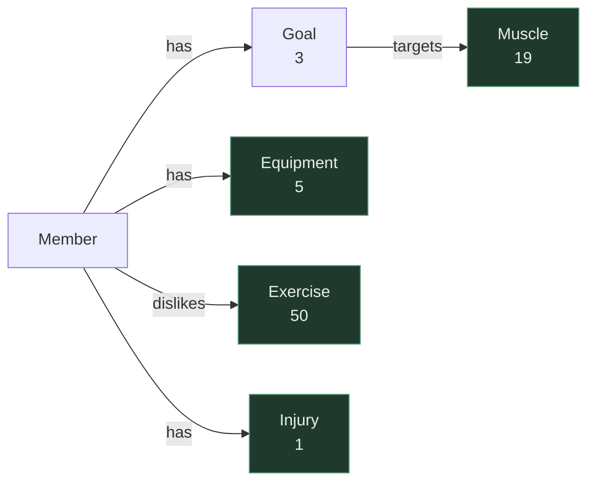

# KG2 — Member Context Schema

## Node types

| Node | Count | Source | Notes |
|---|---|---|---|
| `Member` | 1 | `data/member-context.json` — `profile` | Root of the graph; every KG2 edge originates here or from one of its children |
| `Goal` | 3 | data — `goals[]` | Carries `text`, `priority`, `target_date`, `targets[]` |
| `Equipment` | 5 | data — `equipment_available[]` | **Shared with KG1** — same nodes, joined by name |
| `Exercise` | 50 | KG1 — `data/exercises.json` | **Shared with KG1** — target of `dislikes` |
| `Muscle` | 19 | KG1 — `muscle_groups` | **Shared with KG1** — target of `targets` |
| `Injury` | 1 | data — `injuries[]` | **Shared with KG1** — declared here, contraindication edges live in KG1 |

---

## Edge types

| Edge | From → To | Source | Purpose |
|---|---|---|---|
| `has` | Member → `Goal` \| `Equipment` \| `Injury` | data — `goals[]`, `equipment_available[]`, `injuries[]` | Member ownership. Target label supplies the meaning: **Goal** = intent · **Equipment** = availability filter for KG1 `requires` · **Injury** = entry point to KG1 `contraindicates` / `cautions` |
| `dislikes` | Member → Exercise | data — `preferences.dislikes[]` | Soft exclude; crosses into KG1. The only key of `preferences` the graph models — see below |
| `targets` | Goal → Muscle | data — `goals[].targets[]` | What the goal trains; crosses into KG1. May be empty (non-muscular goals) |

Schema decisions are recorded in [`decisions.md`](decisions.md) under *KG2*.

---

## Diagram

Green = shared with KG1.

---

## Only `dislikes` is modelled, and its misses report rather than fail

`preferences` also holds `preferred_session_minutes`, `training_days_per_week`, `preferred_days`, and free-text `notes`. None of them names another entity, so none has an edge to carry — as nodes they were five identically-labelled neighbours of `Member` expressing no relationship. They stay in `member-context.json`, which is where the copilot reads them from anyway. `dislikes` is the exception because it names exercises, so it becomes `Member -dislikes-> Exercise` directly.

A dislike is free text a coach typed, so it can always name a movement this catalog does not stock — and that is not a defect. The member's preference is true; there is simply nothing to exclude. So `dislikes` is the one cross-graph join that reports its misses and continues, while every structural join stays fatal. The build names what did not match, and `member-context.json` remains the record of what the coach actually typed.

It marks the boundary of a build-time exact-match join. Category words like *"deadlifts"* or *"burpees"* are what the request-time concept resolver exists for, and its fuzzy and embedding passes could plausibly reach a **pattern** rather than an exercise — a distinction this schema has no edge for. Worth revisiting once the resolver exists.
