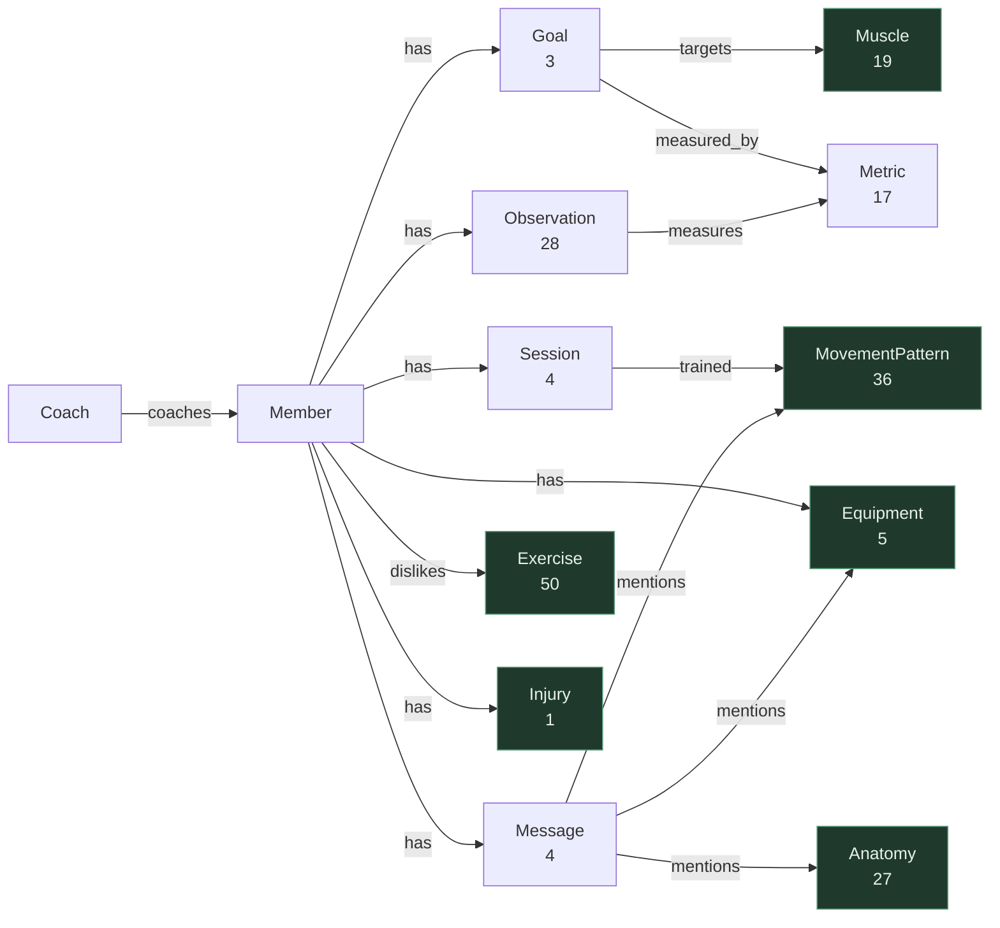

# KG2 — Member Context Schema

Every block of `data/member-context.json` is in this graph. What differs is the
**grain** each lands at, and grain is decided by one test:

> A block becomes a **traversed entity** when something points at it or it
> points at something. It becomes a **leaf observation** when it is
> `(metric, value, date)`. It becomes a **property** when it is a timeless
> scalar. Nothing is here merely so the graph can be said to hold it.

That is `decisions.md` KG2 item 2 sharpened. It rejected `preferred_session_minutes`
as a node and it still does — but it never forced biomarkers out, only forced
them to be modelled as observations rather than as member attributes. Which is
what they already are: `weight_trend_kg` is three dated values,
`sleep_hours_last_7_days` is seven with the dates stripped, every lab carries a
date. The JSON flattens a time series into a scalar; the graph un-flattens it.

## Node types

| Node | Count | Source | Notes |
|---|---|---|---|
| `Member` | 1 | `profile` + the scalar half of `preferences` | Root of the graph |
| `Coach` | 1 | `data/authored/coaches.json` | The name is authored; `profile.coach_id` is the join |
| `Goal` | 3 | `goals[]` | Carries `text`, `priority`, `target_date` |
| `Session` | 4 | `workout_history[]` | `date`, `title`, `completed`, `duration_min`, `rpe` |
| `Message` | 4 | `chat_history[]` | `ts` in UTC, `author`, `text`, attachment captions |
| `Observation` | 28 | `biomarkers`, `labs`, `adherence` | One measurement, one date |
| `Metric` | 17 | `data/authored/metrics.json` | `unit`, reference band, direction-of-good |
| `Equipment` | 5 | `equipment_available[]` | **Shared with KG1** |
| `Exercise` | 50 | KG1 | **Shared** — target of `dislikes` |
| `Muscle` | 19 | KG1 | **Shared** — target of `targets` |
| `Injury` | 1 | `injuries[]` | **Shared** — contraindication edges live in KG1 |
| `MovementPattern` | 36 | KG1 | **Shared** — target of `trained` and `mentions` |
| `AnatomicalStructure` | 27 | KG1 | **Shared** — target of `mentions` |

## Edge types

| Edge | From → To | Count | Purpose |
|---|---|---|---|
| `has` | Member → `Goal` \| `Equipment` \| `Injury` \| `Session` \| `Message` \| `Observation` | 45 | Ownership. The target label supplies the meaning |
| `coaches` | Coach → Member | 1 | Authority to read this member |
| `dislikes` | Member → Exercise | 2 | Soft exclude; crosses into KG1 |
| `targets` | Goal → Muscle | 4 | What a muscular goal trains |
| `measured_by` | Goal → Metric | 1 | How a goal with a number rather than muscles is scored |
| `trained` | Session → MovementPattern | 10 | What class of work a session did |
| `mentions` | Message → `Equipment` \| `AnatomicalStructure` \| `MovementPattern` | 8 | A concept named in writing |
| `measures` | Observation → Metric | 28 | Which quantity, and so which band |

`has` reaches six labels under one type because each target label already
determines the relation — a `has_session` prefix would only restate it.
`trained`, `mentions`, `measures` and `measured_by` are named because they carry
meaning ownership does not, which is the same exception that justifies
`dislikes` and `targets`.

**Totals across both graphs: 224 nodes, 538 edges.**

---

## Diagram



Green = shared with KG1.

---

## `trained` reaches a pattern, not an exercise

`workout_history` names nine movements. **None of them matches a catalog
exercise — not one, and not even as a substring.** There is no `Hip Thrust`, no
`Wall Sit`, no `Band Pull-Apart`; the only `Step-Up` is `Barbell Step Up to
Knee-Drive`, which needs a barbell she does not own.

This document predicted the fix and deferred it — *"its fuzzy and embedding
passes could plausibly reach a **pattern** rather than an exercise, a
distinction this schema has no edge for. Worth revisiting once the resolver
exists."* It exists, and the answer is the pattern.

All nine map cleanly onto patterns that do: `Hip Thrust` and `KB Romanian
Deadlift` to `lower pull - hip lift`, `Goblet Squat (box-supported)` to
`lower push - squat`, `Wall Sit` to both `lower push - squat` and `isometric`.
The mapping is `data/authored/session_patterns.json`, one note per row, and an
unmapped movement **fails the build** — a session that silently trained nothing
is indistinguishable from one she skipped.

That is also the right grain regardless. For longitudinal reasoning what matters
is that she has trained hip-lift twice this week, not which SKU, and pattern is
the axis `is_a` already carries as *"the axis equipment substitutions travel
along"*.

A skipped session names no movements and therefore has no `trained` edges. The
distinction lives in the graph's shape rather than in a property every query has
to remember to filter on.

## `mentions` is what gives a constraint a citation

`resolve/mentions.py` scans each message for canonical concepts, **exact and
alias only**. No fuzzy, no embedding: `mentions` asserts that the member wrote
about a thing, and an edge like that should be certain or absent. It also means
the seed needs no embedding model.

On this member it yields eight edges and no false positives:

| Message | Reaches |
|---|---|
| *"Still no barbell at home btw — only DBs and a kettlebell."* | `Barbell`, `Dumbbell` (via the `dbs` alias), `Kettlebell` |
| *"Knocked out the lower body session! Knee felt okay with the box squats."* | `knee`, `lower body`, `Box`, `lower push - squat` |
| *"How's the knee this morning vs. after?"* (coach) | `knee` |
| *"Skipped Thursday, work blew up and I was wiped."* | nothing, correctly |

The first row is the point. Her equipment constraint is no longer just a list —
it traces to the message where she stated it, which is the difference between a
grounded answer and an asserted one.

Two behaviours are deliberate. A surface matching more than one concept —
`lower back` is a Muscle *and*, by alias, the lumbar spine — produces **no edge
and a report**, the same discipline the resolver applies. And laterality is not
extracted, departing from `decisions.md` *Resolver* 6: there, discarding "left"
would change a filter's behaviour; here the message text is retrieved verbatim
beside the edge, so the side is never lost, only not duplicated onto an edge
that would have to be right about which clause it came from.

## Observations are a leaf, and `measured_by` is why that is not a dead end

Twenty-eight observations hang one hop off `Member` and nothing walks *through*
them. They earn their place on two counts.

The `Metric` vertex is genuinely shared: seventeen of them carry unit, reference
band and direction-of-good, so *"vitamin D at 28 is low"* is a graph fact rather
than a constant in Python that breaks on the next member with age- or
sex-adjusted ranges — HDL and body-fat percentage both have them. And one
retrieval tool with a metric parameter serves sleep, weight, heart rate, HRV and
all twelve lab values, instead of a reader per JSON key.

`MetricDirection` is separate from the band because the two answer different
questions. Resting heart rate forces the split: 58 bpm sits below the adult
60–100 band and that is *favourable*. A bare "outside the range" reading would
report her athletic resting pulse as abnormal.

Then `measured_by`. `goal_sleep` — *"Average 7+ hours of sleep on weeknights"* —
has an empty `targets[]` and was the single goal the graph could say nothing
about; the console compensated with a hardcoded target and a "no target date
means measured" heuristic. One edge replaces both, and makes the observation
subgraph reachable:

```cypher
MATCH (:Member)-[:has]->(g:Goal)-[:measured_by]->(m:Metric)<-[:measures]-(o:Observation)
RETURN g.text, avg(o.value), sum(CASE WHEN o.value < m.optimal_low THEN 1 ELSE 0 END)
```

→ 6.27 h across 7 readings, 5 under target.

**Named empty slot:** `Condition -monitored_by-> Metric`. It is the edge that
would make observations traversed clinically rather than only through a goal,
and it is unpopulated because patellofemoral pain is not monitored by anything
on this panel. Populating it means authoring clinical monitoring claims.

## What is derived rather than ingested

`coach_brief` is generated output dated `2026-06-04` — yesterday's answer, not
member context. A copilot that retrieves a stored conclusion is echoing rather
than reasoning, so the brief, `churn_risk`, `adherence.trend` and
`typical_session_min` are all computed from the graph.

The block is still read, for two reasons. `generated_for` is the reference date
the whole dataset is relative to — nothing here means "this week" against a wall
clock, and anchoring on the real date empties every window and has the copilot
report she has stopped training. And `churn_risk` is the calibration target for
the derivation, which is how the sample's third reason — *"login frequency down
vs. prior month"* — was found to have **no supporting data anywhere in the
file**. A derivation cannot invent it.

## Only `dislikes` and ambiguous mentions report rather than fail

Every structural join is fatal: a goal naming an unknown muscle or metric, a
session movement with no mapping, a coach the directory lacks, equipment or an
injury KG1 did not create. A missing edge there makes the graph misleading
rather than merely incomplete.

Three misses are benign and are reported instead, by `Kg2Report`:

- **Unmatched dislikes.** A member may dislike a movement this catalog does not
  stock. The preference is still true; there is simply nothing to exclude.
- **Ambiguous mentions.** Free text a person wrote is never a build failure.
- **Unobserved metrics.** Definitions are shared across members; a member who
  has never had a DEXA scan is not a defect.

Schema decisions are recorded in [`decisions.md`](decisions.md) under *KG2*.
