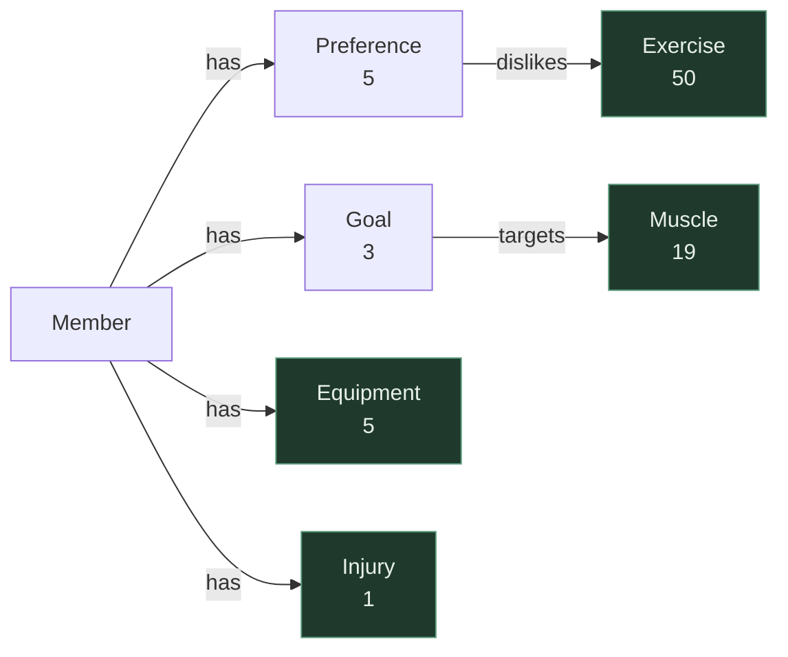

# KG2 — Member Context Schema

## Node types

| Node | Count | Source | Notes |
|---|---|---|---|
| `Member` | 1 | `data/member-context.json` — `profile` | Root of the graph; every KG2 edge originates here or from one of its children |
| `Preference` | 5 | data — `preferences` | One node per preference (`preferred_session_minutes`, `training_days_per_week`, `preferred_days`, `dislikes`, `notes`) |
| `Goal` | 3 | data — `goals[]` | Carries `text`, `priority`, `target_date` |
| `Equipment` | 5 | data — `equipment_available[]` | **Shared with KG1** — same nodes, joined by name |
| `Exercise` | 50 | KG1 — `data/exercises.json` | **Shared with KG1** — target of `dislikes` |
| `Muscle` | 19 | KG1 — `muscle_groups` | **Shared with KG1** — target of `targets` |
| `Injury` | 1 | data — `injuries[]` | **Shared with KG1** — declared here, contraindication edges live in KG1 |

---

## Edge types

| Edge | From → To | Source | Purpose |
|---|---|---|---|
| `has` | Member → `Preference` \| `Goal` \| `Equipment` \| `Injury` | data — `preferences`, `goals[]`, `equipment_available[]`, `injuries[]` | Member ownership. Target label supplies the meaning: **Preference** = constraint on programming · **Goal** = intent · **Equipment** = availability filter for KG1 `requires` · **Injury** = entry point to KG1 `contraindicates` / `cautions` |
| `dislikes` | Preference → Exercise | data — `preferences.dislikes[]` | Soft exclude; crosses into KG1 |
| `targets` | Goal → Muscle | derived from `goals[].text` | What the goal trains; crosses into KG1 |

One `has` rather than four `has_*`: an edge earns its own type only when the source/target label pair doesn't already determine the relation (as with KG1 `contraindicates` vs. `cautions`, both Injury → Pattern). Every Member edge here is disambiguated by its target label, so the prefix restates it. `dislikes` and `targets` stay named — they carry meaning ownership doesn't.

---

## Diagram

Green = shared with KG1.
